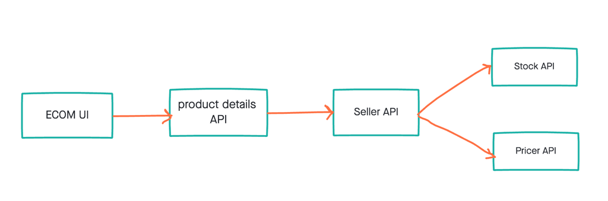

# This project demos following concepts
1) Spring MVC, SpringBoot, SpringWeb
2) Docker container
3) compile, build & push docker containers using maven
4) kubernetes deployment
5) istio
6) traffic management using istio
7) kiali dashboard
8) distributed tracing using zipkin/jaeger

# Flow

#Accessing the page
- get ip address using minikube ip (if its minikube running on virtual box). If not, need to get the ip to cluster
- get port number using "kubectl -n istio-system get service istio-ingressgateway -o jsonpath='{.spec.ports[?(@.name=="http2")].nodePort}'" (otherwise get the physical port binded)
access the page using http://<ip>:<port>/home